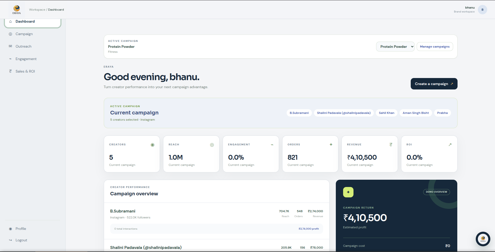
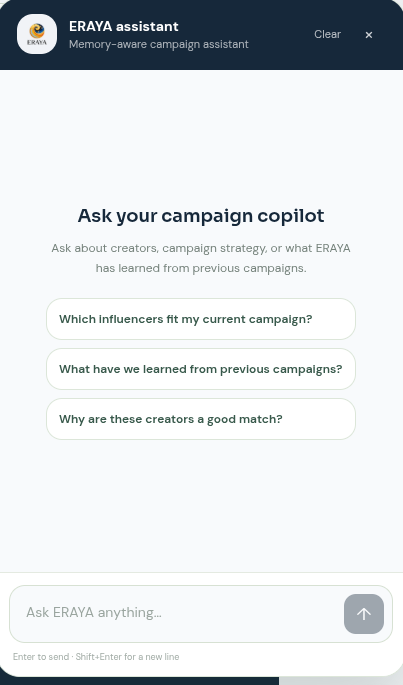
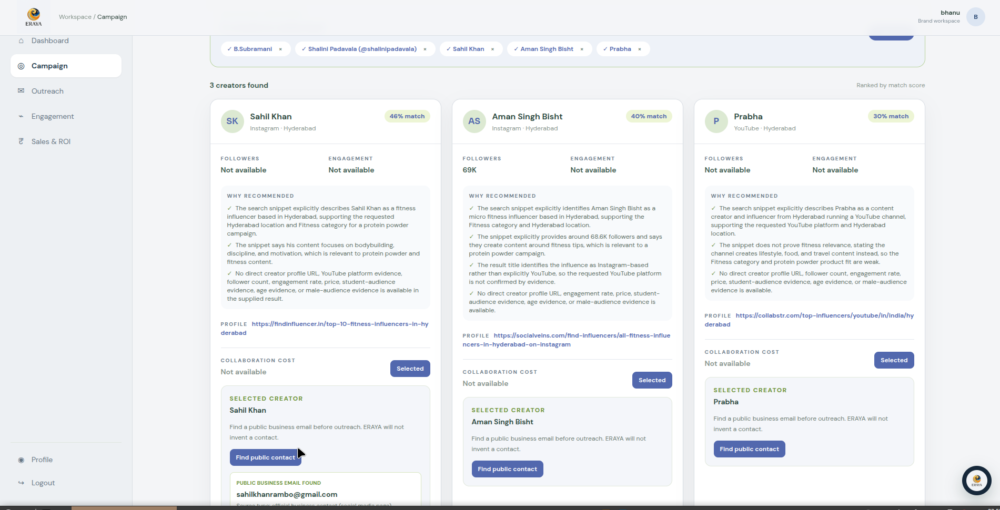
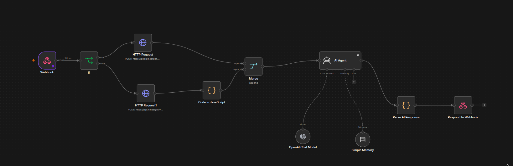

# ERAYA — Memory-Aware AI Influencer Campaign Agent

> **Most AI agents remember the conversation. ERAYA remembers the campaign.**

ERAYA is an AI-powered influencer campaign agent designed to help brands discover creators, understand campaign requirements, generate personalized recommendations, and carry context from one conversation into the next.

The core idea behind ERAYA is simple:

**An AI agent becomes more useful when it can remember what matters.**

Instead of treating every conversation as a fresh session, ERAYA builds on previous campaign context, creator preferences, requirements, and decisions.

---

## The Problem

Imagine briefing an AI agent today:

> Find fitness creators in Hyderabad for my protein powder campaign.

It gives you a list of creators.

Tomorrow, you return and say:

> Find me more creators like the ones we discussed yesterday.

A session-based agent may ask:

> What campaign are you talking about?

The conversation starts again.

The campaign should not.

---

## The ERAYA Approach

ERAYA introduces long-term memory into the influencer campaign workflow.

```text
Conversation
     |
     v
Campaign Context
     |
     v
Memory
     |
     v
Creator Understanding
     |
     v
Recommendations
     |
     v
User Decisions
     |
     v
Updated Memory
     |
     +---------------------> Future Conversations
```

This creates a continuous campaign context instead of isolated conversations.

### Before ERAYA

> "Please provide your campaign requirements again."

### With ERAYA

> "I remember the campaign, your creator preferences, and the decisions we made. Let's continue."

That is the difference between an AI assistant that answers questions and an AI agent that can continue working with you.

---

# What ERAYA Does

ERAYA brings together several capabilities into a single campaign workflow.

### Persistent Campaign Memory

Important campaign information can be retained across conversations, reducing the need to repeatedly provide the same brief.

### Intelligent Creator Matching

Creators are evaluated against campaign requirements such as platform, audience, location, niche, reach, engagement, and budget.

### Memory-Aware Conversations

Previous campaign context can be retrieved and used when generating new responses.

### Structured Recommendations

Creator information is returned as structured data and transformed into clear recommendation cards in the frontend.

### Decision Memory

Previous selections, preferences, and decisions can become context for future recommendations.

### Workflow Orchestration

n8n connects the different stages of the agent, from incoming campaign requests to memory retrieval, creator matching, response generation, and memory updates.

---

# How ERAYA Works

```text
                         USER
                           |
                           v
                  Campaign / Chat Request
                           |
                           v
                    n8n Workflow
                           |
             +-------------+-------------+
             |                           |
             v                           v
      Memory Retrieval            Campaign Analysis
             |                           |
             +-------------+-------------+
                           |
                           v
                  Creator Discovery
                           |
                           v
                   Creator Matching
                           |
                           v
                  AI Recommendation
                           |
                           v
                  Structured Response
                           |
                           v
                       Frontend
                           |
                           v
                    User Decision
                           |
                           v
                   Memory Update
                           |
                           +------> Future Conversations
```

---

# Long-Term Memory with Hindsight

ERAYA uses Hindsight as its long-term memory layer.

The purpose of memory is not simply to store old conversations.

It is to preserve information that can become useful context for future decisions.

ERAYA can retain information such as:

* Campaign objectives
* Target audience
* Platform requirements
* Creator preferences
* Budget requirements
* Previous recommendations
* Previous creator decisions
* Campaign context
* Conversation history

This allows the agent to build continuity across interactions.

---

# The Memory Loop

One of the important ideas behind ERAYA is the feedback loop between conversations and decisions.

```text
                Campaign
                   |
                   v
             Recommendation
                   |
                   v
             User Decision
              /          \
             /            \
        Selected        Rejected
             \            /
              \          /
                   v
                 Memory
                   |
                   v
          Future Recommendation
```

A creator decision made today can become useful context for a recommendation made tomorrow.

---

# ERAYA in Action

## Campaign Dashboard



The campaign interface provides a central workspace for managing campaign activity and creator recommendations.

## AI Campaign Assistant



The conversational interface allows users to interact with the campaign agent while maintaining relevant campaign context.

## Creator Recommendations



Creator information is presented in a structured format so users can quickly understand why a creator matches the campaign.

## Agent Workflow



n8n orchestrates the flow between the frontend, memory layer, AI processing, creator matching, and response generation.

---

# Creator Recommendation

A typical structured response from the agent can contain information such as:

```json
{
  "creator_name": "Example Creator",
  "platform": "Instagram",
  "followers": 144000,
  "engagement_rate": 4.8,
  "match_score": 91,
  "location": "Hyderabad",
  "estimated_price": "₹25,000"
}
```

The frontend converts this structured response into creator recommendation cards.

This keeps the AI workflow flexible while giving the user a consistent interface.

---

# Example: A Campaign That Remembers

Suppose a brand is launching a protein powder campaign.

### First conversation

The user says:

> Find Instagram fitness creators in Hyderabad for my protein powder campaign.

ERAYA processes the campaign requirements and generates creator recommendations.

The user selects a few creators and rejects others.

Those decisions can become part of the campaign context.

### Later conversation

The user returns and says:

> Find me more creators for the same campaign.

Instead of rebuilding the brief from scratch, ERAYA can use the existing campaign context and previous preferences.

The conversation continues.

The campaign continues.

---

# Technology

| Technology   | Role                    |
| ------------ | ----------------------- |
| React        | Frontend application    |
| TypeScript   | Application development |
| Vite         | Development and build   |
| Tailwind CSS | Interface styling       |
| n8n          | Workflow orchestration  |
| Hindsight    | Long-term memory        |
| Node.js      | Development environment |
| Webhooks     | Agent communication     |
| JSON         | Structured data         |

---

# Architecture

```text
+---------------------------------------------------+
|                   ERAYA FRONTEND                  |
|              React + TypeScript + Vite            |
+-------------------------+-------------------------+
                          |
                          | HTTP / Webhooks
                          v
+---------------------------------------------------+
|                       n8n                         |
|                  Workflow Layer                  |
|                                                   |
|   Campaign Input                                  |
|        |                                          |
|        v                                          |
|   Memory Retrieval                                |
|        |                                          |
|        v                                          |
|   Campaign Understanding                          |
|        |                                          |
|        v                                          |
|   Creator Discovery                               |
|        |                                          |
|        v                                          |
|   Creator Matching                                |
|        |                                          |
|        v                                          |
|   Recommendation Generation                       |
|        |                                          |
|        v                                          |
|   Memory Update                                   |
+-------------------+---------------+---------------+
                    |               |
                    v               v
             +------------+   +-------------+
             | Hindsight  |   | Creator Data|
             |   Memory   |   | / Sources   |
             +------------+   +-------------+
```

---

# Project Structure

```text
Ai-influencer-agent/
|
├── docs/
|   ├── images/
|   |   ├── dashboard.png
|   |   ├── chat.png
|   |   ├── recommendations.png
|   |   └── n8n-workflow.png
|   |
|   └── n8n-api-contract.md
|
├── public/
├── src/
|   ├── api/
|   ├── components/
|   ├── pages/
|   └── App.tsx
|
├── .env.example
├── package.json
├── vite.config.ts
└── README.md
```

---

# Getting Started

## Prerequisites

You will need:

* Node.js 18 or later
* npm
* Git
* An n8n instance for the live workflow
* Required AI and memory service credentials

## Clone the repository

```bash
git clone https://github.com/sushanth-10/Ai-influencer-agent.git
cd Ai-influencer-agent
```

## Install dependencies

```bash
npm install
```

## Configure environment variables

Create a local environment file:

```bash
cp .env.example .env.local
```

Configure the required n8n endpoints and other environment variables.

```env
VITE_USE_MOCK_API=false
VITE_N8N_BASE_URL=your_n8n_url
VITE_N8N_CAMPAIGN_WEBHOOK=your_campaign_webhook
VITE_N8N_RECOMMENDATIONS_WEBHOOK=your_recommendations_webhook
VITE_N8N_OUTREACH_WEBHOOK=your_outreach_webhook
VITE_N8N_CHAT_WEBHOOK=your_chat_webhook
```

Never commit API keys, private tokens, or credentials to the repository.

## Run locally

```bash
npm run dev
```

## Build for production

```bash
npm run build
```

---

# n8n Integration

n8n acts as the orchestration layer connecting the frontend with the agent workflow.

The workflow handles:

* Campaign input
* Memory retrieval
* AI processing
* Creator discovery
* Creator matching
* Recommendation generation
* Memory updates
* Frontend responses

The API contract is documented in:

```text
docs/n8n-api-contract.md
```

---

# Future Development

ERAYA is designed as a foundation for a larger campaign intelligence system.

Potential extensions include:

* Multi-platform creator discovery
* Automated influencer outreach
* Campaign performance analytics
* Creator relationship history
* Budget-aware recommendations
* Campaign performance feedback
* Improved memory retrieval
* Authentication
* Multi-user campaign workspaces
* Production deployment

---

# Team

ERAYA was built as an AI agent project focused on combining long-term memory, creator discovery, intelligent matching, and workflow automation for influencer marketing.

---

# Repository

GitHub:

https://github.com/sushanth-10/Ai-influencer-agent

---

# ERAYA

**Remember the campaign.
Understand the context.
Continue the work.**
